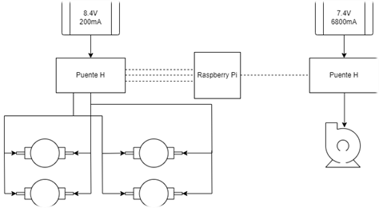
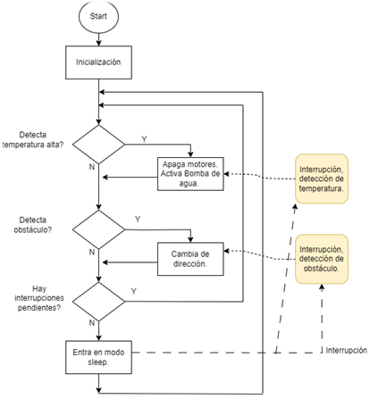

# FireForce

FIreforce es un proyecto que busca adecuar un sistema de sensores a un vehiculo de control autonomo, para la respuesta contra incendios.

El vehiculo Fireforce está equipado con una serie de sensores y actuadores que le permiten navegar de forma autónoma , detectar obstaculos y fuego, para posteriormente activar un sistema de extinción de incendios. El vehículo se controla mediante el sistema de la Raspberry Pi Pico.

El codigo fuente presente se divide en dos etapas, una modular, en donde están las funcionalidades por separado del sistema, como lo es el funcionamiento de los actuadores y la sensorica del mismo. Así cómo un modulo más complejo en donde se integran todas las funcionalidades, mediante el uso de flujo de programa presuntamente como polling + Interrupciones. 

A continuación se presente un modulo de bloques cercano a la implementación, donde se definen los actuadores, el MCU, los puente H, encargado de controlar los motores del vehículo y otro destinado únicamente para la bomba de Agua. Por otro lado, se tiene el sistema de alimentación por separado, para alimentar los dos puente H, el primero con baterias de Ion de litio, para suministrar lo necesario a los motores, la segunda batería, se encarga del puente H de la bomba de agua encargada de extinguir el fuego.

# Diagrama de bloques de HW

Cómo se mencionó anteriormente, el flujo de programa se basó en Polling + Interrupciones, lo cual se refleja con el siguiente diagrama: 

# Diagrama de bloques de FW

# Requisitos Funcionales y No Funcionales

* Funcionales implementados: Detección de calor  , Control de movimiento, SIstema de Extinción.
* No funcionales:Seguridad, Mantenibilidad, Portabilidad.
* 
